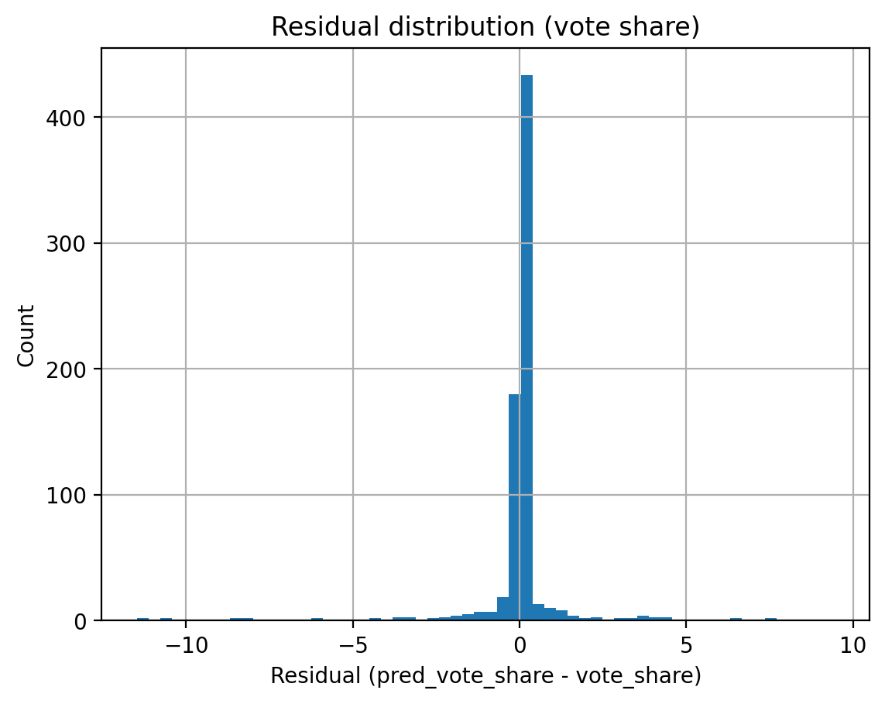
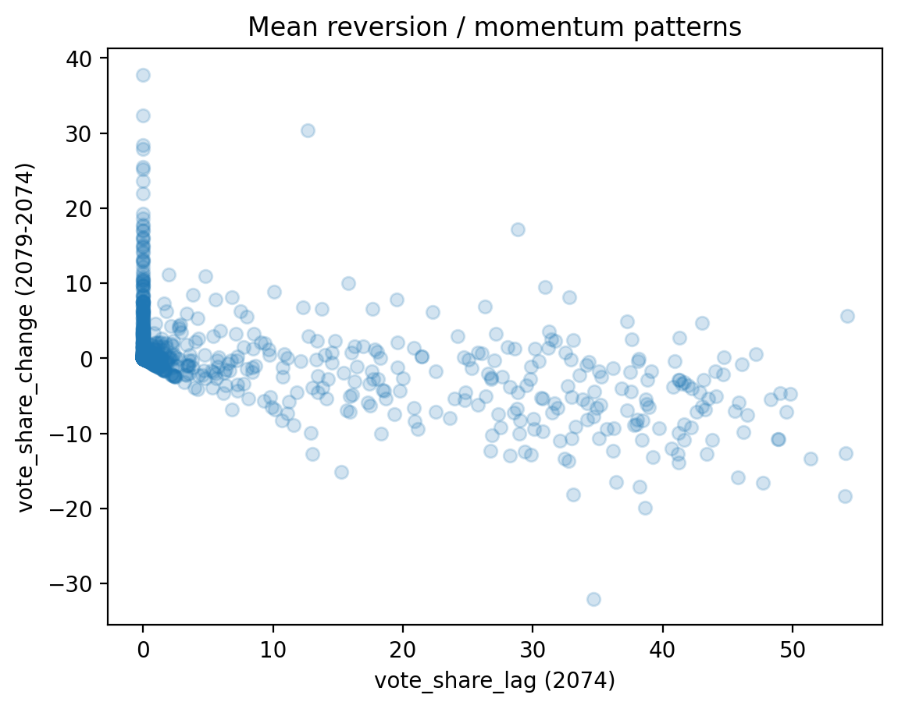
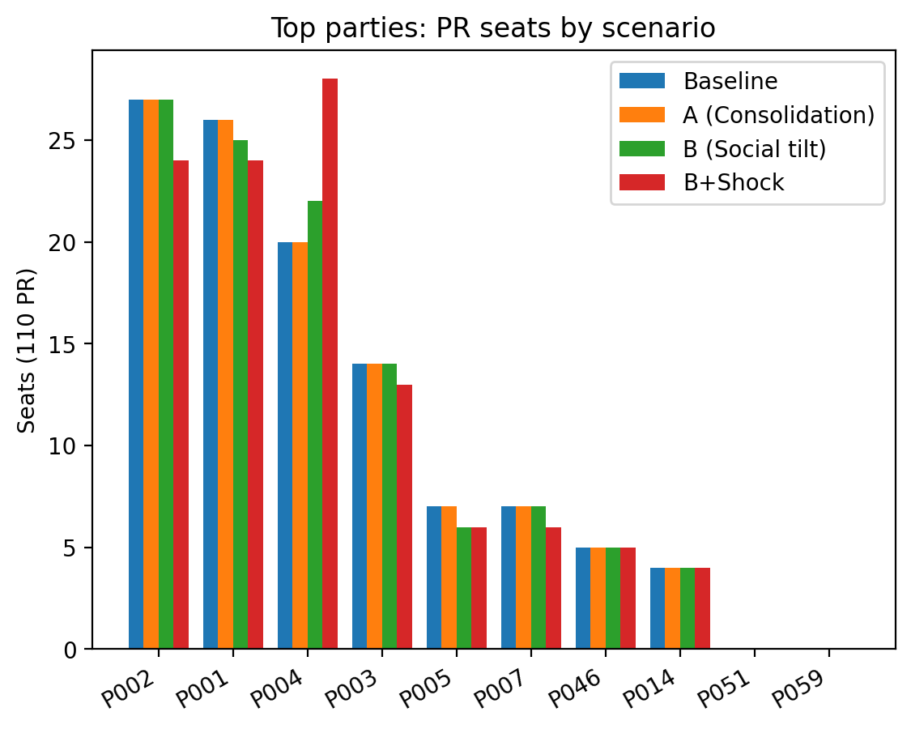

# Election Analytics Nepal 2082  
**Proportional Representation (PR) Forecasting & Seat Allocation**

## Executive Summary
This project builds an **end-to-end data science pipeline** to forecast **Proportional Representation (PR) election outcomes** for Nepal’s 2082 snap election.

Using historical election results, census demographics, voter roll indicators, and bounded scenario assumptions, the system produces:
- District-level vote share forecasts
- National vote share aggregation
- Final PR seat allocation under Nepal’s electoral rules

The project is designed for **non-routine political environments** marked by instability, youth mobilization, and the emergence of new political parties, conditions where historical patterns alone are insufficient for reliable forecasting.

**Outcome:**  
A reproducible, scenario-aware forecasting framework demonstrating how data science supports **decision-making under uncertainty**.

---

## Why This Project Matters
Nepal’s 2082 election follows a period of political instability and mass youth protests, creating:
- Weak historical signals for emerging parties
- Shifting voter coalitions
- Structural uncertainty not captured by standard time-series models

This project treats elections as a **market-share forecasting problem under regime stress**, making it directly transferable to:
- Market share prediction
- Risk and scenario modeling
- Policy and economic analysis
- Strategic analytics in finance and business contexts

---

## Project Scope
**Included**
- Proportional Representation (PR) elections
- District-level and national forecasting
- Rule-based seat allocation

**Planned**
- First-Past-The-Post (FPTP) constituency modeling  
  *(pending candidate-level datasets)*

---

## Model Validation (Held-out Districts)
Model performance is evaluated using **district-level holdout validation** to test spatial generalization.This simulates forecasting in unseen regions rather than re-predicting known outcomes.


### Actual vs Predicted Vote Share
Predicted vs actual vote shares for districts excluded from training.


**Key takeaway**
- Strong alignment between predictions and observations  
- Indicates generalization rather than overfitting

---

### Residual Distribution
Residuals (predicted − actual vote share) are centered around zero.



**Key takeaway**
- No strong systematic bias  
- Errors are symmetric and bounded

---

## Key Drivers of Vote Share Change
Feature importance from a gradient-boosted model highlights dominant explanatory signals.

.png)

**Consistent drivers**
- Prior vote share (momentum / incumbency effects)
- Youth and Gen-Z alignment
- Leadership visibility and following
- Demographic and literacy indicators

This confirms that **structural factors dominate short-term noise**.This improves robustness when projecting outcomes in volatile political environments.


---

## Exploratory Insight: Momentum vs Mean Reversion
Vote share change plotted against prior vote share reveals structural dynamics.



**Observed pattern**
- Large parties tend to exhibit **mean reversion**
- Smaller and newer parties show **positive momentum**
- Gains are asymmetric during periods of instability

This insight informed both model design and scenario constraints.

---

## Scenario Analysis & Seat Allocation
To address uncertainty not captured by historical data, the project includes **bounded scenario adjustments**:
- Micro-party vote consolidation
- Social media engagement tilt
- Backlash penalties
- Shock-gated amplification for high-momentum parties

### PR Seat Allocation by Scenario
Seat outcomes under alternative assumptions.



**Why this matters**
- Small vote-share changes can produce **nonlinear seat outcomes**
- Scenario modeling exposes representation risk hidden by point forecasts
- Translates analytics into **decision-relevant outputs**

---

## Repository Structure
```
election-analytics-nepal-2082/
├── config/                     # Scenario and consolidation parameters
│
├── data/
│   ├── raw/                    # Source datasets
│   ├── processed/              # Cleaned modeling tables
│   ├── outputs/                # Predictions, seats, metrics, figures
│   ├── results/
│       └── figures/            # Figures used in README
|
├── src/
│   ├── models/
│   │   └── pr/                 # PR model training, backtesting, prediction
│   ├── pr/                     # Aggregation and PR seat allocation logic
│   ├── features/               # Feature engineering & transforms
│   └── utils/                  # IO helpers and validation utilities
│
├── scripts/                    # Reproducible execution scripts
├── notebooks/                  # Analysis & visualization notebooks
│
├── README.md
└── PROJECT_CHARTER.md
```
---

## How to Run (End-to-End)

Run all commands from the **project root directory**.

### 1) Train the final PR model
Trains the district-level vote share change model using historical PR results and demographic features.

```bash
python scripts/pr_train_final.py
```

### 2) Backtest (district holdout)
Evaluates model performance using district-level holdout validation.

```bash
python scripts/pr_backtest.py
```

### 3) Predict 2082 PR vote shares
Generates district-level and national PR vote share predictions for the 2082 election.

```bash
python scripts/pr_predict_2082.py
```

### 4) Run consolidation, sentiment scenarios, and seat allocation
Applies micro-party consolidation, social media tilt and backlash penalties, optional shock gating, and PR seat allocation using the Sainte-Laguë method.

```bash
python scripts/pr_consolidation_with_sentiment.py
```

---

## Key Outputs

All outputs are written to `data/outputs/`.

**Predictions**
- `pr_predictions_district_2082.csv`
- `pr_predictions_national_2082.csv`

**Scenario Results**
- `pr_national_consolidated_structure.csv`
- `pr_national_consolidated_social_tilt.csv`
- `pr_national_consolidated_social_tilt_shock.csv`

**PR Seat Allocation**
- `pr_seats_*.csv`

**Evaluation**
- `pr_backtest_metrics.json`

---

## Key Modeling Decisions & Tradeoffs
- Modeled **vote share change** instead of absolute share to improve temporal stability
- Used **district-holdout validation** to test spatial generalization
- Treated social media signals as **bounded scenario modifiers**, not predictors
- Prioritized interpretability and robustness over marginal accuracy gains

These reflect real-world constraints where **data is incomplete but decisions must still be made**.

---
## Assumptions & Limitations

- The valid turnout for 2082 is assumed to be unchanged from 2079.
- Social media engagement is **not representative** of the electorate and is used only as a bounded scenario overlay.
- Models rely on historical relationships and cannot fully capture real-time campaign dynamics.
- Predictions are **probabilistic and exploratory**, not guarantees of electoral outcomes.

---

## Ethical Note

This project is intended strictly for **analytical and educational purposes**.

- No individual-level data is used
- No targeted political messaging or persuasion is performed
- All social media data is analyzed at an **aggregate level only**

---

## Future Work

- Candidate-level and constituency-level (FPTP) modeling

